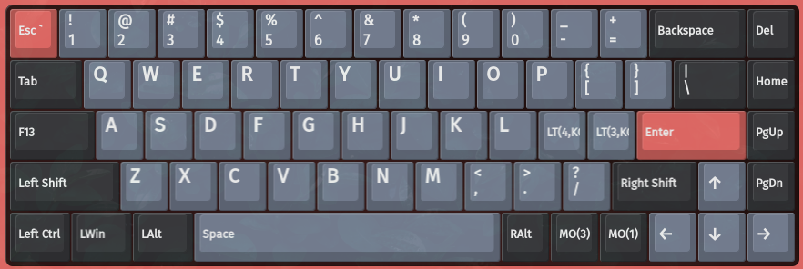
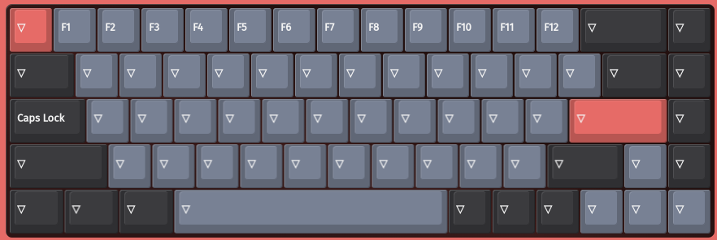
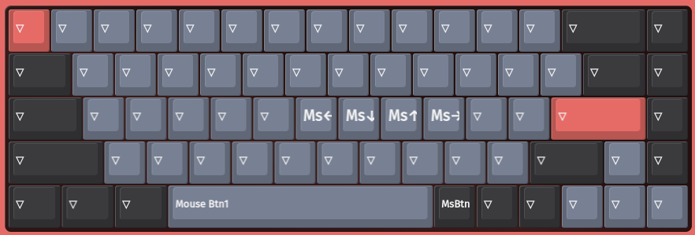
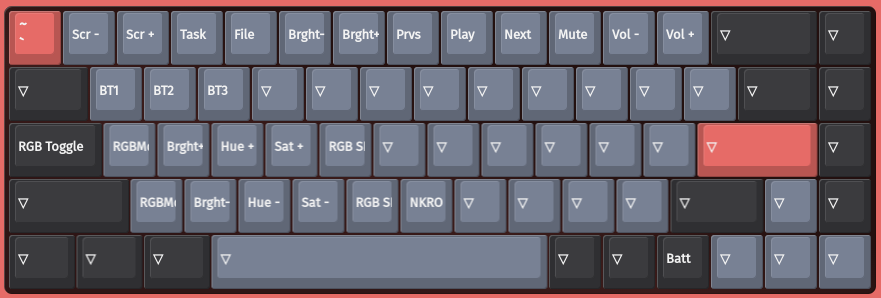
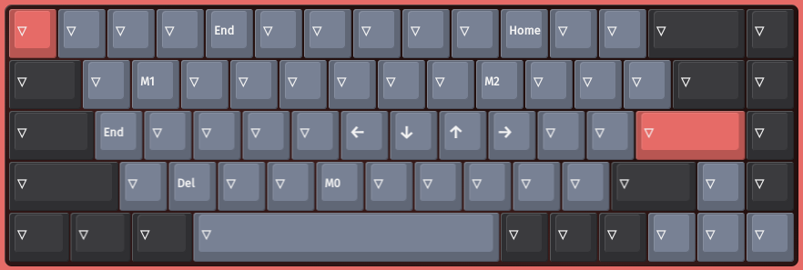

# K7 Pro

# Layers

## Layer 0

Defualt layer (DIP switch set to Mac)

## Layer 1

Function layer

## Layer 2

Mouse control layer.

## Layer 3

Keychron FN layer.

## Layer 4

Vim layer

# Macros
* M0
  * Ctrl down
  * Left
  * Ctrl up
* M1
  * Ctrl down
  * Right
  * Ctrl up
* M2
  * End
  * Enter

