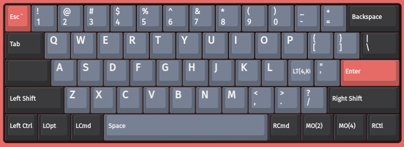
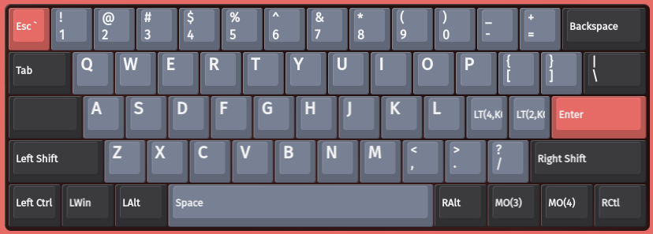
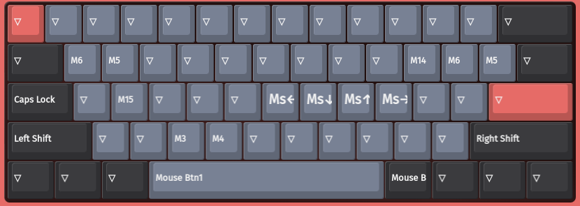
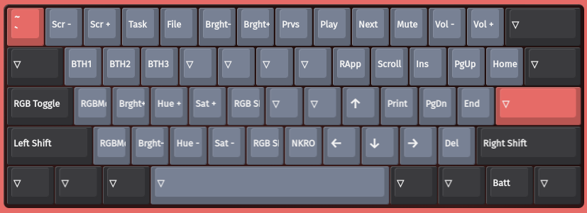
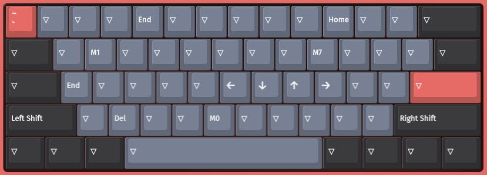

# K9 Pro

# Layers

## Layer 0

Mac layer, currently unused.

## Layer 1

 
Default Windows layer.

## Layer 2

Mouse control layer.

## Layer 3

Keychron FN layer.

## Layer 4

Vim layer

# Macros

* M0
  * Ctrl down
  * Left down
  * Left up
  * Ctrl up
* M1
  * Ctrl down
  * Right down
  * Right up
  * Ctrl up
* M3-M6
  * Old work stuff, can be removed
* M7
  * End
  * Enter
